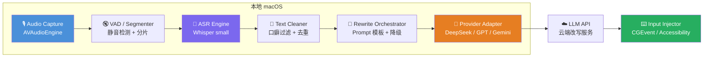
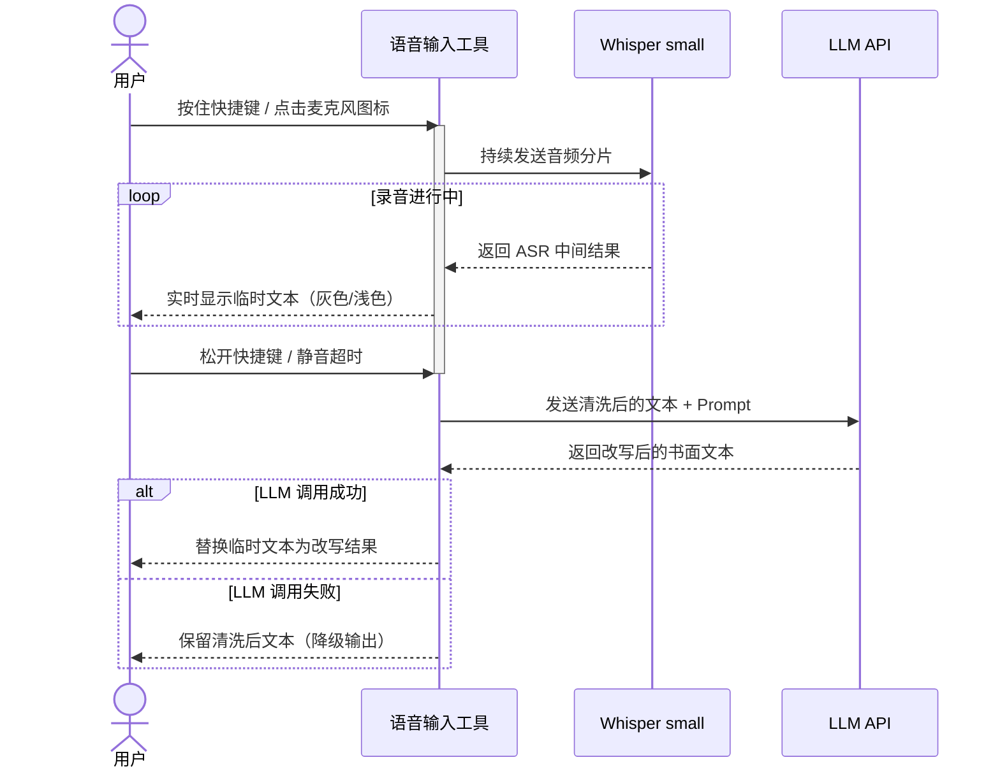

# 语音输入工具 · 高层设计文档（HLD）

> **Whisper small（本地 ASR） + 可配置 LLM API（云端改写）**

| 项目       | 说明                                         |
| ---------- | -------------------------------------------- |
| 文档版本   | v1.0                                         |
| 目标平台   | macOS                                        |
| 文档范围   | 覆盖目标、架构、关键模块、交互流程、性能/成本、风险与测试要点 |
| 最后更新   | 2026-03-17                                   |

---

## 1. 背景与目标

### 1.1 项目背景

在日常工作与沟通场景中，语音输入能显著提升文字录入效率，但原始语音转录往往带有口语化表述、重复词汇和逻辑断裂等问题，不利于直接作为书面内容使用。本项目旨在构建一款 **macOS 原生语音输入工具/助手（非 IME）**，通过本地 ASR（Whisper small）实现低延迟语音识别，并借助可配置的云端 LLM API 对识别结果进行书面化改写，使最终输出语义准确、表达流畅、可直接用于正式文档与协作场景。

### 1.2 设计目标

| 目标         | 说明                                                         |
| ------------ | ------------------------------------------------------------ |
| 输入形态     | 系统级语音输入工具/助手（非 IME），用户通过快捷键（按住/点击）触发语音录入 |
| 实时反馈     | 录音过程中实时显示 ASR 中间结果，录入结束后输出 LLM 校准文本   |
| 语言覆盖     | 以中文为主（约 90%），英文为辅（约 10%）                      |
| 体验优先     | **录音结束后 2–4 秒**内完成最终文本输出                       |
| LLM 可配置   | 支持切换 LLM Provider（DeepSeek / OpenAI GPT / Google Gemini） |

### 1.3 非目标（当前版本不涉及）

- **IME 输入法实现（InputMethodKit）**：v1 不做，后续版本再评估。
- **全本地 LLM 推理**：受限于模型体积与计算资源，改写环节暂依赖云端 API，本地 LLM 可作为后续版本演进方向。
- **专有名词 100% 识别准确**：可通过热词增强机制持续优化，但不作为 v1 的硬性指标。

---

## 2. 关键需求

| 需求维度 | 具体要求                                                           |
| -------- | ------------------------------------------------------------------ |
| 实时性   | 录音结束后 **2–4 秒**内输出最终文本（在 2–3 秒分片 + 单次 LLM 请求假设下） |
| 准确性   | ASR 识别率可接受即可（Whisper small 基线），由 LLM 改写提升最终表达质量 |
| 可配置性 | API Provider、Model Name、API Key、Endpoint 均可在设置界面中切换      |
| 隐私保护 | 音频数据**仅在本地处理**（Whisper 本地推理）；文本数据可发送至云端 LLM |
| 稳定性   | 网络异常或 API 超时时，系统自动降级，**保留清洗后的 ASR 文本**作为最终输出 |

---

## 3. 总体架构

系统采用 **“本地 ASR + 本地改写编排 + 云端 LLM API”** 的混合架构，核心数据流如下：



**架构分层说明：**

| 层级             | 职责                                              | 运行位置 |
| ---------------- | ------------------------------------------------- | -------- |
| 音频采集层       | 麦克风录音、采样率统一                              | 本地     |
| 语音分片层       | VAD 静音检测、音频分段、overlap 处理                 | 本地     |
| 语音识别层       | Whisper small 模型推理，输出原始转录文本              | 本地     |
| 文本清洗层       | 口癖词过滤、重复短语合并、无效短句丢弃               | 本地     |
| 改写编排层       | 构建 Prompt、调用 LLM、处理降级逻辑                  | 本地（调用云端 API） |
| Provider 适配层  | 统一不同 LLM API 的请求/响应格式                     | 本地     |
| 云端 LLM API     | 文本改写能力提供方                                  | 云端     |
| 文本注入层       | 将最终文本注入当前活跃输入框                         | 本地     |

---

## 4. 交互流程

### 4.1 用户操作流程



### 4.2 输出策略

| 阶段       | 显示方式                                 | 说明                                 |
| ---------- | ---------------------------------------- | ------------------------------------ |
| 录音中     | 灰色/浅色临时文本，0.5–1s 刷新频率       | 给予用户“系统正在工作”的实时反馈     |
| 改写完成   | 替换临时文本为最终改写结果                | 正式文本以正常样式呈现               |
| 改写失败   | 保留清洗后的 ASR 文本                    | 降级策略，确保输入内容不丢失         |
| 注入失败   | 复制到剪贴板并提示用户粘贴               | 在安全输入或特殊 App 时兜底          |

### 4.3 替换与会话规则

- 每次录音生成独立会话 ID，仅允许同一会话替换临时文本。  
- 若用户在 LLM 返回前手动输入或移动光标，则放弃自动替换，改为追加提示或保持原状。  
- 若检测到焦点切换或注入失败，则触发剪贴板兜底并提示用户手动粘贴。

---

## 5. 核心模块设计

### 5.1 Audio Capture（音频采集）

- **技术方案**：macOS `AVAudioEngine` 框架  
- **采样率**：统一 **16 kHz**（Whisper 模型标准输入格式）  
- **声道**：单声道（Mono）  
- **缓冲区**：按需配置 buffer size，平衡延迟与稳定性  

### 5.2 VAD / Segmenter（语音活动检测与分片）

语音分片策略直接影响识别精度与延迟，核心参数如下：

| 参数           | 推荐值         | 说明                                 |
| -------------- | -------------- | ------------------------------------ |
| 静音触发阈值   | 300–600 ms     | 超过该时长的静默视为语句间断          |
| 最小片段长度   | 1–2 s          | 片段过短可能导致识别准确率下降        |
| 最大片段长度   | 3–4 s          | 片段过长会增加识别延迟                |
| Overlap 策略   | 启用           | 片段间重叠一定时长，防止切割导致丢词  |

> **建议**：片段时长控制在 **2–3 秒**区间为最佳平衡点。  
> **Overlap 去重**：基于时间戳对齐 + 重叠去重合并，避免重复文本。

### 5.3 ASR Engine（语音识别引擎）

- **模型**：`whisper-small`（本地部署）  
- **推理性能**：0.8–1.2× 实时（即 1 秒音频在 0.8–1.2 秒内完成识别）  
- **语言设定**：主要语言设为中文（`zh`），自动检测英文混杂输入  
- **加速方案**：可考虑 Core ML 转换或 Metal GPU 加速以进一步降低延迟  

### 5.4 Text Cleaner（文本清洗）

本模块在 ASR 输出与 LLM 改写之间进行预处理，以降低 LLM Token 消耗并提升改写质量：

| 功能         | 说明                                               |
| ------------ | -------------------------------------------------- |
| 口癖词过滤   | 移除“嗯”“啊”“那个”“就是”“然后”等高频口语填充词     |
| 重复短语合并 | 检测并合并连续重复的短语（如“我觉得我觉得”→“我觉得”） |
| 无效短句过滤 | 丢弃长度过短且无实际语义的片段                       |

### 5.5 Rewrite Orchestrator（改写编排）

- **职责**：构建统一 Prompt，调用 Provider Adapter，处理改写结果  
- **Prompt 模板管理**：维护标准化 Prompt 模板（详见 [第 6 节](#6-llm-改写接口统一抽象)）  
- **超时与降级**：单次请求，超时（建议 2–3 秒）即降级，保留清洗后的文本作为最终输出  

### 5.6 Provider Adapter（Provider 适配层）

为不同 LLM API Provider 提供统一的调用抽象：

| Provider  | API 格式         | 备注                         |
| --------- | ---------------- | ---------------------------- |
| DeepSeek  | OpenAI-compatible | 成本最低，推荐作为默认 Provider |
| OpenAI    | OpenAI Chat API   | 质量稳定，成本较高            |
| Gemini    | Google AI API     | 需独立适配请求/响应格式       |

**通用机制：**
- 统一入参/出参格式  
- 单次请求，超时即降级  
- 限流感知与队列缓冲（必要时排队而非重试）

### 5.7 Input Injector（文本注入）

- **技术方案**：`CGEvent` 模拟键盘输入为主，`Accessibility API` 兜底  
- **核心能力**：支持“替换临时文本”——先删除已显示的 ASR 临时文本，再注入 LLM 改写结果  
- **兼容性**：安全输入（密码框）或部分 App 可能无法注入  
- **兜底策略**：注入失败时自动复制到剪贴板，并提示用户手动粘贴  

---

## 6. LLM 改写接口（统一抽象）

### 6.1 函数签名

```
rewrite(text, provider, model, apiKey, endpoint) -> rewritten_text
```

| 参数       | 类型   | 说明                                     |
| ---------- | ------ | ---------------------------------------- |
| `text`     | String | ASR 识别并清洗后的原始文本                |
| `provider` | Enum   | LLM Provider 标识（deepseek / openai / gemini） |
| `model`    | String | 模型名称（如 `deepseek-chat`、`gpt-4o-mini`）    |
| `apiKey`   | String | API 密钥                                 |
| `endpoint` | String | API 端点 URL                             |

**返回值**：改写后的书面化文本（String）；若调用失败则返回**清洗后的输入文本**。

### 6.2 标准 Prompt 模板

```text
请对以下文本做口语转书面化处理，保留原意，
去掉口癖和重复，逻辑更清楚，输出简洁顺畅：

文本：{input_text}
```

> **Prompt 设计原则**：  
> - 强调“**保留原意**”以避免 LLM 过度改写导致语义偏移  
> - 指令简短明确，减少因指令歧义导致的不稳定输出  
> - 后续版本可支持用户自定义 Prompt 以适配不同写作风格  

---

## 7. 体验优化策略

| 策略                 | 实现方式                                               | 预期效果               |
| -------------------- | ------------------------------------------------------ | ---------------------- |
| 实时 ASR 反馈        | 每 0.5–1 秒刷新一次 ASR 中间结果                        | 降低用户等待焦虑       |
| 静音智能分段         | 静音触发最终段落提交 + LLM 校准                         | 自然的语句边界识别     |
| 渐进式输出           | LLM 返回前显示灰色临时文本，返回后平滑替换              | 避免界面突兀跳变       |
| 降级透明化           | LLM 失败时保留清洗后文本并给出轻提示（如 toast 通知）    | 用户知晓当前输出状态   |
| 注入失败兜底         | 自动复制到剪贴板并提示用户粘贴                           | 避免关键场景无法输入   |
| 快捷键体验           | 支持“按住说话”与“点击切换”两种模式                     | 适配不同用户操作习惯   |
| 音频输入设备选择     | 设置界面支持选择麦克风设备                               | 外接麦克风等场景兼容   |

---

## 8. 性能与成本估算

### 8.1 延迟预算

| 环节       | 预计耗时         | 说明                         |
| ---------- | ---------------- | ---------------------------- |
| ASR 推理   | 0.8–1.2× 实时    | 3 秒音频 ≈ 2.4–3.6 秒推理时间 |
| 文本清洗   | < 50 ms          | 纯文本处理，可忽略           |
| LLM 改写   | 0.3–1.2 秒 / 段  | 取决于 Provider 和网络质量   |
| 文本注入   | < 100 ms         | 系统级 API 调用              |
| **端到端** | **2–4 秒**       | 从录音结束到文本最终输出      |

> 以上预算基于 2–3 秒分片与单次 LLM 请求的假设。

### 8.2 成本估算（基于 1 小时连续语音输入）

| 指标           | 估算值                    |
| -------------- | ------------------------- |
| 中文字数       | 约 6,000–10,000 字        |
| Token 消耗     | 约 10,000–20,000 tokens   |
| DeepSeek 费用  | ≈ ¥0.3–1.0 / 小时         |
| OpenAI GPT 费用 | ≈ ¥2–5 / 小时（约为 DeepSeek 的 3–5 倍） |
| Gemini 费用    | ≈ ¥1–3 / 小时             |

> 以上估算基于 2026-03-17 公开价格与输入/输出约 1:1 的假设，实际成本以当日价格与使用情况为准。  
> DeepSeek 在成本效益上具有显著优势，推荐作为默认 Provider。

---

## 9. 安装包体量

| 组件             | 体积         |
| ---------------- | ------------ |
| Whisper small 模型 | ~466 MB     |
| 应用本体          | 50–200 MB   |
| **总安装体积**    | **0.6–1 GB** |

> 首次安装需下载较大的模型文件，建议提供进度条与断点续传能力。

---

## 10. 风险与应对

| 风险场景       | 影响程度 | 影响描述             | 应对措施                                       |
| -------------- | -------- | -------------------- | ---------------------------------------------- |
| 网络连接失败   | 🔴 高    | LLM 改写不可用       | 自动降级保留清洗后文本，UI 提示当前为离线模式    |
| API 限流       | 🟡 中    | 改写输出延迟增加     | 队列缓冲，超时后降级输出                         |
| LLM 误改语义   | 🟡 中    | 用户对输出失去信任   | Prompt 强调“保留原意”；提供撤销/回退功能       |
| 专有名词识别错误 | 🟡 中  | 关键术语出错         | 支持用户自定义热词/词库；ASR 层注入热词权重     |
| 注入受限（安全输入/特殊 App） | 🔴 高 | 无法写入目标应用 | 剪贴板兜底 + 提示用户手动粘贴                   |
| Accessibility 权限被拒 | 🔴 高 | 兜底注入不可用 | 引导用户授权；保持 CGEvent 主路径               |
| API Key 泄露风险 | 🟡 中 | 账号与费用安全风险 | Keychain 存储、日志脱敏、传输仅 HTTPS           |
| 模型加载缓慢   | 🟡 中    | 首次启动体验差       | 启动时后台预加载模型；提供加载进度指示          |

---

## 11. 测试策略

### 11.1 功能与质量测试

| 测试维度               | 测试方法                                             | 通过标准                       |
| ---------------------- | ---------------------------------------------------- | ------------------------------ |
| ASR 识别准确率（WER）  | 使用标准中文语音数据集进行 WER 评估                    | WER ≤ 15%（中文场景）          |
| LLM 改写满意度         | 人工评分（5 分制），覆盖不同口语风格样本               | 平均评分 ≥ 3.5                 |
| 端到端延迟             | 统计 P50 / P90 延迟                                   | P90 ≤ 4 秒                     |
| 注入兼容性             | 常见 App（邮件/文档/浏览器/IDE）场景验证              | 核心场景可用                   |

### 11.2 稳定性与异常测试

| 测试场景     | 预期行为                                         |
| ------------ | ------------------------------------------------ |
| 断网         | 自动降级保留清洗后文本，UI 给出网络异常提示        |
| API 限流     | 队列缓冲，超时后降级                               |
| 长时间连续输入 | 内存与 CPU 占用保持稳定，无内存泄漏              |
| 异常音频输入 | 静音/噪声环境下不产生无意义输出                   |
| 焦点切换/手动输入 | 放弃自动替换，避免误删用户内容               |
| 安全输入框   | 注入失败时触发剪贴板兜底并提示用户               |

---

## 12. 后续演进方向

| 方向                  | 说明                                                   | 优先级 |
| --------------------- | ------------------------------------------------------ | ------ |
| 用户自定义热词        | 在设置界面中维护热词列表，注入 ASR 层提升专有名词识别率  | P1     |
| 术语白名单            | 对特定领域术语进行保护，改写时不做替换                   | P1     |
| 多 Provider A/B 测试  | 同一文本同时发送至多个 Provider，对比改写质量与延迟      | P2     |
| 本地 LLM 版本         | 引入轻量级本地 LLM（如 Phi-3 / Qwen2）实现全离线改写    | P2     |
| 自定义 Prompt 模板    | 允许用户选择或编辑改写风格（正式/简洁/技术文档等）       | P2     |
| IME 版本探索          | 评估 InputMethodKit 方案，形成真正的系统级输入法         | P3     |
| 多语言深度支持        | 增强日语、韩语等多语言识别与改写能力                     | P3     |

---

## 术语表

| 术语       | 全称 / 说明                                                |
| ---------- | ---------------------------------------------------------- |
| ASR        | Automatic Speech Recognition，自动语音识别                  |
| VAD        | Voice Activity Detection，语音活动检测                      |
| WER        | Word Error Rate，词错误率，衡量 ASR 准确性的核心指标        |
| LLM        | Large Language Model，大型语言模型                          |
| HLD        | High-Level Design，高层设计文档                             |
| Provider   | LLM API 服务提供商（如 DeepSeek、OpenAI、Google Gemini）    |
| CGEvent    | macOS Core Graphics Event，底层输入事件模拟机制             |
| IME        | Input Method Editor，输入法                                |
| InputMethodKit | macOS 输入法开发框架（IME 方案）                         |
| Overlap    | 音频分片重叠区域，防止因切割导致词语丢失                     |
